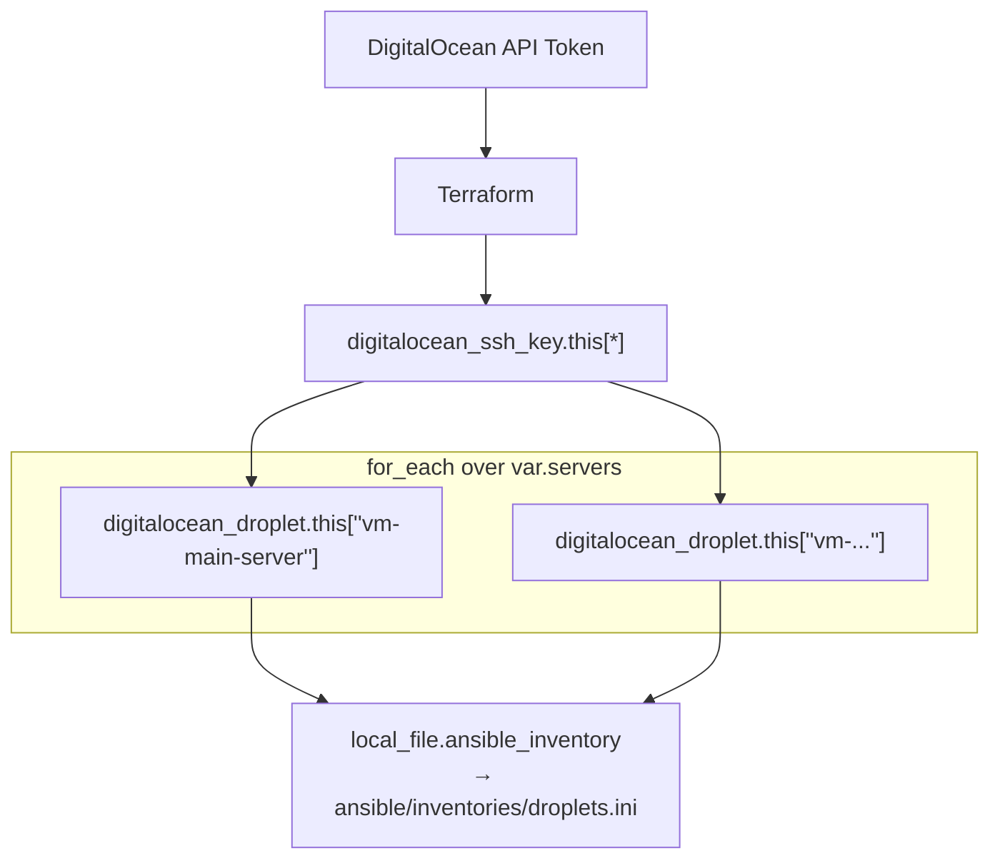

# Terraform — Personal Cloud Infrastructure

> Infrastructure-as-Code for my personal cloud environment.  
> **Provider:** DigitalOcean · **Provisioner:** Terraform + Ansible

---

## Table of Contents

- [Architecture](#architecture)
- [Prerequisites](#prerequisites)
- [Quickstart](#quickstart)
- [Project Layout](#project-layout)
- [Makefile Workflow](#makefile-workflow)
- [Variables](#variables)
- [Outputs](#outputs)
- [Kubernetes Cluster](#kubernetes-cluster)
- [Argo CD Bootstrap](#argo-cd-bootstrap)
- [Ansible Integration](#ansible-integration)
- [Security](#security)
- [Cleanup](#cleanup)

---

## Architecture



- **N Droplets** — one per entry in `var.servers`, each with per-server image/region/size/tags.
- SSH keys registered at provision time, shared by all Droplets.
- Ansible inventory generated automatically with per-tag host groups.

---

## Prerequisites

| Requirement            | Details                                                                         |
| ---------------------- | ------------------------------------------------------------------------------- |
| **Terraform**          | `>= 1.0` ([install guide](https://developer.hashicorp.com/terraform/install))   |
| **DigitalOcean Token** | Fine-grained PAT with write scope — see [Security](#security)                   |
| **SSH Keys**           | Public keys uploaded to your DO account or provided inline via `secrets.tfvars` |
| **Make**               | (Optional) `make` for the workflow targets below                                |

---

## Quickstart

```bash
# 1. Clone & enter
cd terraform

# 2. Copy and populate secrets
cp secrets.tfvars.example secrets.tfvars
# Edit secrets.tfvars — add your DO token and SSH public key(s)

# 3. Initialize
make init

# 4. Preview
make plan

# 5. Deploy
make deploy
```

**Manual Terraform commands** (equivalent):

```bash
terraform -chdir=infrastructure init
terraform -chdir=infrastructure plan -var-file=../secrets.tfvars
terraform -chdir=infrastructure apply -auto-approve -var-file=../secrets.tfvars
```

---

## Project Layout

```
.
├── infrastructure/          # Terraform root module
│   ├── main.tf              # Resources: Droplet, SSH keys, inventory file
│   ├── provider.tf          # DigitalOcean provider config
│   ├── variables.tf         # Input variable declarations
│   ├── outputs.tf           # Output values (IP, URN)
│   ├── versions.tf          # Provider version constraints
│   ├── inventory.tmpl       # Ansible inventory template
│   ├── terraform.tfstate    # State file (local)
│   └── tfplan               # Binary plan output (generated)
├── ansible/
│   └── inventories/
│       └── droplets.ini     # Generated Ansible inventory
├── secrets.tfvars           # ❗ Sensitive — do not commit
├── secrets.tfvars.example   # Safe template
├── Makefile                 # Convenience targets
└── README.md
```

---

## Makefile Workflow

| Target          | Command                           | Description                    |
| --------------- | --------------------------------- | ------------------------------ |
| `make init`     | `terraform init`                  | Initialize providers & backend |
| `make plan`     | `terraform plan`                  | Preview changes                |
| `make out`      | `terraform plan -out=tfplan`      | Save plan to binary file       |
| `make apply`    | `terraform apply tfplan`          | Apply saved plan               |
| `make deploy`   | `terraform apply -auto-approve`   | Quick deploy (no plan review)  |
| `make destroy`  | `terraform destroy -auto-approve` | Tear down all resources        |
| `make fmt`      | `terraform fmt`                   | Format all `.tf` files         |
| `make validate` | `terraform validate`              | Validate configuration         |

All plan/apply/destroy targets automatically pass `-var-file=../secrets.tfvars`.

---

## Variables

| Name              | Type               | Default              | Description                                                     |
| ----------------- | ------------------ | -------------------- | --------------------------------------------------------------- |
| `do_token`        | `string`           | —                    | DigitalOcean API Personal Access Token                          |
| `ssh_public_keys` | `map(string)`      | —                    | SSH key name → public key value pairs                           |
| `default_region`  | `string`           | `sgp1`               | Default region (fallback for servers)                           |
| `default_size`    | `string`           | `s-1vcpu-1gb`        | Default Droplet size (fallback for servers)                     |
| `default_image`   | `string`           | `debian-13-x64`      | Default OS image (fallback for servers)                         |
| `servers`         | `map(object({…}))` | `{ vm-main-server }` | Server definitions — see [Server config](#server-configuration) |

### Server configuration

Add servers by extending the `servers` map in `secrets.tfvars`:

```hcl
servers = {
  "vm-main-server" = {
    tags = ["main-server"]
  }
  "vm-worker-01" = {
    region = "nyc1"
    size   = "s-2vcpu-2gb"
    tags   = ["worker", "web"]
  }
  "vm-db-01" = {
    image  = "ubuntu-24-04-x64"
    size   = "s-2vcpu-4gb"
    tags   = ["database"]
  }
}
```

Each server key becomes the Droplet name. All fields are optional — missing values fall back to `default_region`, `default_size`, `default_image`.

---

## Outputs

| Name          | Description                                                      |
| ------------- | ---------------------------------------------------------------- |
| `droplets`    | Full map of all Droplets with IP, URN, region, size, image, tags |
| `droplet_ips` | Quick lookup: server name → public IPv4                          |

Retrieve after deploy:

```bash
terraform -chdir=infrastructure output droplet_ips
```

---

## Kubernetes Cluster

| Attribute     | Value                | Notes                        |
| ------------- | -------------------- | ---------------------------- |
| **Name**      | `lab-cluster`        | Singleton — one cluster only |
| **Region**    | `var.default_region` | Inherits `sgp1` default      |
| **Version**   | `1.34.8-do.1`        | DO-managed Kubernetes        |
| **Node pool** | 3 × `s-2vcpu-2gb`    | Worker-pool, 6 GB total      |

### Prerequisites — kubectl

```bash
# No Package Manager + AMD64
curl -LO "https://dl.k8s.io/release/$(curl -L -s https://dl.k8s.io/release/stable.txt)/bin/linux/amd64/kubectl"
chmod +x kubectl
sudo mv kubectl /usr/local/bin/
kubectl version --client
```

### Usage

```bash
# Temporary (current shell)
export KUBECONFIG=$(pwd)/kubeconfig
kubectl get nodes

# Or pass inline every time
kubectl --kubeconfig=./kubeconfig get pods -A

# Or use direnv (persistent per directory)
# echo 'export KUBECONFIG=$(pwd)/kubeconfig' >> .envrc && direnv allow
```

The cluster deploys alongside the Droplets in the same `terraform apply` run:

```bash
make deploy
export KUBECONFIG=$(pwd)/kubeconfig
kubectl cluster-info
kubectl get nodes
```

> **Note:** DOKS may take several minutes to provision. Terraform will block until the control plane is ready.

---

## Argo CD Bootstrap

Install Argo CD on the cluster and connect it to a GitHub repo for GitOps.

### Prerequisites — argocd CLI

```bash
# Linux / WSL (AMD64) — latest stable
curl -sSL -o argocd-linux-amd64 https://github.com/argoproj/argo-cd/releases/latest/download/argocd-linux-amd64
sudo install -m 555 argocd-linux-amd64 /usr/local/bin/argocd
rm argocd-linux-amd64
argocd version --client
```

### Install Argo CD on the cluster

```bash
kubectl create namespace argocd
kubectl apply -n argocd --server-side --force-conflicts -f https://raw.githubusercontent.com/argoproj/argo-cd/stable/manifests/install.yaml
kubectl get pods -n argocd -w
```

### Access the API server

```bash
# Port-forward (no LB needed for dev/lab)
kubectl port-forward svc/argocd-server -n argocd 8443:443

# Optional: patch to LoadBalancer for persistent access
# kubectl patch svc argocd-server -n argocd -p '{"spec": {"type": "LoadBalancer"}}'
```

### Login & change password

```bash
# Retrieve initial password
argocd admin initial-password -n argocd

# Login via port-forward
argocd login localhost:8443 --insecure

# Change password immediately
argocd account update-password
```

### GitHub repo bootstrap

Connect Argo CD to a GitHub repository so it can sync manifests:

```bash
# Add a private GitHub repo (HTTPS + PAT)
argocd repo add https://github.com/<org>/<repo>.git \
  --username <your-github-username> \
  --password <github-pat-or-token> \
  --upsert

# Or via SSH
argocd repo add git@github.com:<org>/<repo>.git \
  --ssh-private-key-path ~/.ssh/id_ed25519 \
  --upsert
```

> **PAT scope** — The token needs at least `repo` scope for private repos.

### Deploy the first app

```bash
argocd app create <app-name> \
  --repo https://github.com/<org>/<repo>.git \
  --path <manifests-dir> \
  --dest-server https://kubernetes.default.svc \
  --dest-namespace default \
  --sync-policy automated
```

Or via declarative manifest (`argo-app.yaml`):

```yaml
apiVersion: argoproj.io/v1alpha1
kind: Application
metadata:
  name: <app-name>
  namespace: argocd
spec:
  project: default
  source:
    repoURL: https://github.com/<org>/<repo>.git
    path: <manifests-dir>
    targetRevision: HEAD
  destination:
    server: https://kubernetes.default.svc
    namespace: default
  syncPolicy:
    automated:
      prune: true
      selfHeal: true
```

---

## Ansible Integration

After `apply`, Terraform generates `ansible/inventories/droplets.ini` from `infrastructure/inventory.tmpl`:

```ini
[all:vars]
ansible_user=root

[all]
vm-main-server ansible_host=203.0.113.1 region=sgp1 size=s-1vcpu-1gb image=debian-13-x64

[tag_main-server]
vm-main-server ansible_host=203.0.113.1
```

Servers are automatically grouped by tag (e.g. `[tag_web]`, `[tag_database]`), so you can target specific groups:

```bash
# All servers
ansible-playbook -i ansible/inventories/droplets.ini playbooks/site.yml

# Only web workers
ansible-playbook -i ansible/inventories/droplets.ini --limit tag_web playbooks/site.yml
```

---

## Security

- **`secrets.tfvars`** contains your DO token and SSH private key material — **never commit** this file.
- The DO token is consumed via `var.do_token` (marked `sensitive = true` in Terraform).
- SSH keys are registered with the Droplet at provision time — no post-provision key injection required.
- Consider using a vault or environment variables instead of plain-text `.tfvars` for production setups.

---

## Cleanup

```bash
make destroy
```

This tears down all managed resources. The state file is **local** — delete `infrastructure/terraform.tfstate*` manually if you want a full reset.
