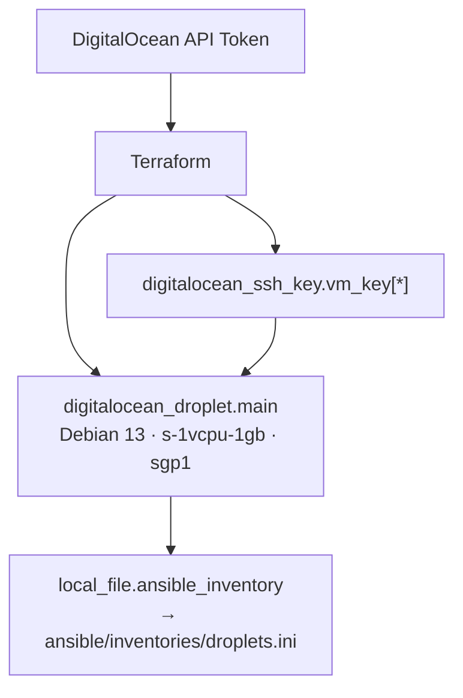

# Terraform — Personal Cloud Infrastructure

> Infrastructure-as-Code for my personal cloud environment.  
> **Provider:** DigitalOcean · **Provisioner:** Terraform + Ansible

---

## Table of Contents

- [Architecture](#architecture)
- [Prerequisites](#prerequisites)
- [Quickstart](#quickstart)
- [Project Layout](#project-layout)
- [Makefile Workflow](#makefile-workflow)
- [Variables](#variables)
- [Outputs](#outputs)
- [Ansible Integration](#ansible-integration)
- [Security](#security)
- [Cleanup](#cleanup)

---

## Architecture



- Single Droplet (`vm-main-server`) in `sgp1` region running Debian 13.
- SSH keys registered with the Droplet at creation time.
- Ansible inventory file generated automatically after `apply`.

---

## Prerequisites

| Requirement            | Details                                                                         |
| ---------------------- | ------------------------------------------------------------------------------- |
| **Terraform**          | `>= 1.0` ([install guide](https://developer.hashicorp.com/terraform/install))   |
| **DigitalOcean Token** | Fine-grained PAT with write scope — see [Security](#security)                   |
| **SSH Keys**           | Public keys uploaded to your DO account or provided inline via `secrets.tfvars` |
| **Make**               | (Optional) `make` for the workflow targets below                                |

---

## Quickstart

```bash
# 1. Clone & enter
cd terraform

# 2. Copy and populate secrets
cp secrets.tfvars.example secrets.tfvars
# Edit secrets.tfvars — add your DO token and SSH public key(s)

# 3. Initialize
make init

# 4. Preview
make plan

# 5. Deploy
make deploy
```

**Manual Terraform commands** (equivalent):

```bash
terraform -chdir=infrastructure init
terraform -chdir=infrastructure plan -var-file=../secrets.tfvars
terraform -chdir=infrastructure apply -auto-approve -var-file=../secrets.tfvars
```

---

## Project Layout

```
.
├── infrastructure/          # Terraform root module
│   ├── main.tf              # Resources: Droplet, SSH keys, inventory file
│   ├── provider.tf          # DigitalOcean provider config
│   ├── variables.tf         # Input variable declarations
│   ├── outputs.tf           # Output values (IP, URN)
│   ├── versions.tf          # Provider version constraints
│   ├── inventory.tmpl       # Ansible inventory template
│   ├── terraform.tfstate    # State file (local)
│   └── tfplan               # Binary plan output (generated)
├── ansible/
│   └── inventories/
│       └── droplets.ini     # Generated Ansible inventory
├── secrets.tfvars           # ❗ Sensitive — do not commit
├── secrets.tfvars.example   # Safe template
├── Makefile                 # Convenience targets
└── README.md
```

---

## Makefile Workflow

| Target          | Command                           | Description                    |
| --------------- | --------------------------------- | ------------------------------ |
| `make init`     | `terraform init`                  | Initialize providers & backend |
| `make plan`     | `terraform plan`                  | Preview changes                |
| `make out`      | `terraform plan -out=tfplan`      | Save plan to binary file       |
| `make apply`    | `terraform apply tfplan`          | Apply saved plan               |
| `make deploy`   | `terraform apply -auto-approve`   | Quick deploy (no plan review)  |
| `make destroy`  | `terraform destroy -auto-approve` | Tear down all resources        |
| `make fmt`      | `terraform fmt`                   | Format all `.tf` files         |
| `make validate` | `terraform validate`              | Validate configuration         |

All plan/apply/destroy targets automatically pass `-var-file=../secrets.tfvars`.

---

## Variables

| Name              | Type          | Default       | Description                            |
| ----------------- | ------------- | ------------- | -------------------------------------- |
| `do_token`        | `string`      | —             | DigitalOcean API Personal Access Token |
| `ssh_public_keys` | `map(string)` | —             | SSH key name → public key value pairs  |
| `region`          | `string`      | `sgp1`        | DigitalOcean region slug               |
| `droplet_size`    | `string`      | `s-1vcpu-1gb` | Droplet size slug                      |

---

## Outputs

| Name          | Description                                |
| ------------- | ------------------------------------------ |
| `droplet_ip`  | Public IPv4 address of the main server     |
| `droplet_urn` | Uniform Resource Name (URN) of the Droplet |

Retrieve after deploy:

```bash
terraform -chdir=infrastructure output
```

---

## Ansible Integration

After `apply`, Terraform generates `ansible/inventories/droplets.ini` from `infrastructure/inventory.tmpl`:

```ini
[droplets]
<droplet_ip> ansible_user=root
```

You can then run playbooks directly:

```bash
ansible-playbook -i ansible/inventories/droplets.ini playbooks/site.yml
```

---

## Security

- **`secrets.tfvars`** contains your DO token and SSH private key material — **never commit** this file.
- The DO token is consumed via `var.do_token` (marked `sensitive = true` in Terraform).
- SSH keys are registered with the Droplet at provision time — no post-provision key injection required.
- Consider using a vault or environment variables instead of plain-text `.tfvars` for production setups.

---

## Cleanup

```bash
make destroy
```

This tears down all managed resources. The state file is **local** — delete `infrastructure/terraform.tfstate*` manually if you want a full reset.
